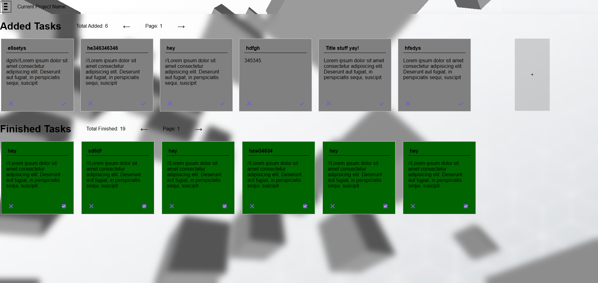

This is a practice project To-do list! Here I test adding more complex features for practice! (OBS! Comments in scripts are mostly me organizing my thoughts/understanding)

Visual Overhaul:

This project contains:

- Create tasks, move them to Finished or back to added (as well as delete)
- Pagination for both Added & Finished task rows
- Switch 3 different colors
- Toggle hide description, finished/added tasks, hiding desc will also display more tasks as only titles
- Simple 3d animated background using NPM package three.js
- Download and Upload localstorage data(If you CBA testing it, trust me it works)

Will add:

- Trying to come up with more
- Drag and drop tasks, no idea how to make this.
- Maybe adding tags & searchbar if I feel like it
- Maybe adding an entirely separate page for projects where you can add  tasks for diff projects

Pain points:

- No error handling for corrupt local storage etc
- Messy massive script
- Next time I might try using JS classes (though I don't entirely know what that is)
- A little bitof repetitive code
- No media queries for smaller resolutions, or mobile versions etc

Clone the repository:
git clone https://github.com/OliverEriksso/Localstorage-TodoList

Nodejs Install dependencies (THIS IS ONLY FOR 3D BACKGROUND):

- npm install three
- npx vite

(OBS!) If you run npx vite and you see it's hosting on localhost, you open it and it's not connecting, try changing the port e.g to: npx vite --port 4000

 Open your browser: After running the server, open your browser and navigate to http://localhost:(port here).
